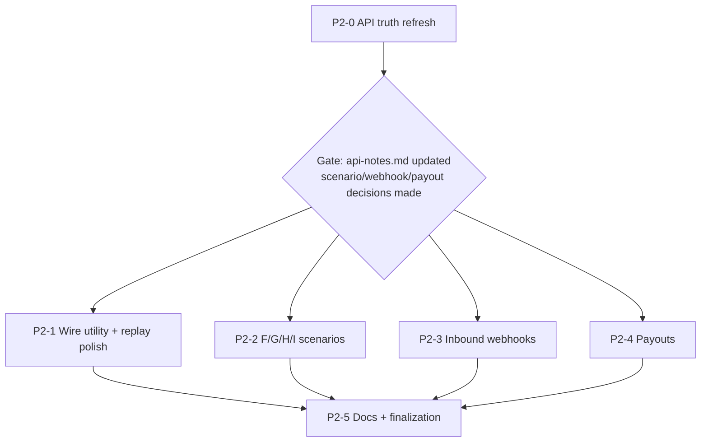

# Straddle Sandbox Explorer — Agent-Orchestrated Implementation Plan (refined)

## Context

Greenfield repo: only `docs/spec.md` (Technical Design v2), `docs/design.md`, `CLAUDE.md`, and a stub README exist (verified). The spec fully defines architecture, contracts, wave plan (§13), and coordination rules (§14); this plan maps those waves onto Workflow-tool fan-outs — one workflow per wave, main session as integrator (gates, commits, steering) between waves.

**Decisions locked in:** sandbox key ready · full scope through Wave 5 (P1) · Workflow fan-out per wave · **user will configure this remote environment for sandbox access** (see Step 0).

**Environment facts found during planning (these reshape the draft):**
- No `STRADDLE_API_KEY` in this environment.
- The network policy currently 403-blocks CONNECT to `sandbox.straddle.io` / `api.straddle.io` / `production.straddle.io` (verified via the agent proxy). npm registry access works.
- This container is ephemeral — anything not pushed is lost on idle-reclaim.
- Node v22 available (spec requires ≥20 — fine).

## Status as of 2026-07-07 (supersedes parts of Step 0)

Verified live in the previous cloud session:

- ✅ `STRADDLE_API_KEY` present **and works**: `GET https://sandbox.straddle.io/v1/customers` with `Authorization: Bearer` returned HTTP 200, empty list. M0 head start: **Bearer auth confirmed; response envelope is `{data, meta, response_type}`** with `meta.{page_number,page_size,total_pages,max_page_size,sort_by,sort_order,total_items,api_request_id,api_request_timestamp}` — feed this to the 0a agent.
- ✅ Network policy now allows `*.straddle.io`.
- ❌ That session's repo had **no git remote and no `gh`** → user decided: **push the project to GitHub and recreate the cloud session from that GitHub source** (standard GitHub-proxy auth; per-wave pushes and the final PR then work).

**For the fresh session (created from the GitHub repo):**
1. Re-run the Step 0 checks below (key, network, and now `git remote -v` must show origin).
2. The old container's local branch `straddle-explorer-impl` (commit `82daeb1`: `.gitignore`, `.env.example`, CLAUDE.md newline fix) is lost unless the user pushed it — if absent, recreate that pre-commit first (contents in "Pre-commit" below), push, then launch Wave 0.
3. Everything else proceeds unchanged from Wave 0.

## Step 0 — Environment gate (before anything else)

The user is updating the remote environment (network policy allowing `*.straddle.io` + `STRADDLE_API_KEY` env var). At execution start:

1. Verify key: `STRADDLE_API_KEY` present in env (never print it).
2. Verify network: `curl -sS -o /dev/null -w "%{http_code}" https://sandbox.straddle.io/v1/customers` returns an HTTP status (401/403-from-Straddle is fine — that's reachability; `000`/CONNECT-403 is the proxy still blocking).
3. If either fails: **stop immediately** and report exactly what to configure (environment settings → network policy add `*.straddle.io`; add `STRADDLE_API_KEY` secret; note a policy change may require a fresh session). Do not spend agent tokens while blocked.
4. Single manual auth ping (one `curl` with the key, response body only, never the request headers echoed) to confirm the key works before Wave 0.

## Ground rules (every wave)

- **File ownership is the concurrency mechanism** (spec §14): disjoint file sets per agent; no worktree isolation. Root `package.json`/tsconfigs are owned by the Wave 1 scaffolding step — later agents request dependency additions via their structured output, I apply them.
- **Contract freeze after Wave 1:** `shared/` changes route through me with synchronized updates to engine tests, HTTP tests, and UI fixtures in one change.
- **Exactly one sandbox-touching agent at a time** (M0 phases; Wave 2 API-client owner; live gates and dry runs run by me).
- **Between waves I run the gate myself** (typecheck, tests, `check:secrets` once it exists), fix or dispatch fixes, then **commit AND push** — pushing per-wave is mandatory in an ephemeral container.
- Branch: `straddle-explorer-impl` off `main`; PR opened at the end (Wave 6).
- Agents return structured output (schema): files written, decisions made, test results, dependency requests, spec deviations. Deviations go into `docs/spec.md` + README "Deviations from spec" at the gate where they're found (CLAUDE.md rule).
- Agents never print the key; redaction rules per spec §8.

## Wave/gate flow

```mermaid
flowchart TD
  S0["Step 0: env gate<br/>key + network verified"] --> P["Pre-commit: .gitignore, .env.example"]
  P --> W0["Wave 0 workflow: M0 spike<br/>0a → (0b×2) → (0c×2) → 0d"]
  W0 --> G0{"Gate: api-notes.md sane?<br/>15-min budget arithmetic holds?"}
  G0 --> W1["Wave 1 workflow: scaffold → shared → 4∥ (redactor, logger, bus+recorder, mock) → verify"]
  W1 --> G1{"Gate: tests green, redaction zero-survival<br/>CONTRACT FREEZE"}
  G1 --> W2["Wave 2 workflow: 5∥ (real client*, scenarios, poller, evaluator+report, check-secrets) → runner+CLI → mock integration"]
  W2 --> G2{"Gate: tests + live smoke --scenario a"}
  G2 --> W3["Wave 3 workflow: 2∥ (http+registry, integration+round-trip test)"]
  W3 --> G3{"Gate: round-trip green, curl /api/health"}
  G3 --> W4["Wave 4 workflow: tokens+shell → 2∥ (store+api, components) → Playwright QA"]
  W4 --> G4{"Gate: live Run All ≤15min, epoch reset demo"}
  G4 --> W5["Wave 5 workflow: 2∥ (replay, SSE) → 3∥ web panels → CLI --serial"]
  W5 --> G5{"Gate: offline replay of recorded C"}
  G5 --> W6["Wave 6: live dry-run, README agent,<br/>final checks (me), §16 checklist, PR"]
  style G0 fill:#fff3cd
  style G2 fill:#fff3cd
  style G4 fill:#fff3cd
```

(* = sole sandbox-touching agent in its wave; ∥ = parallel agents; amber gates involve live sandbox.)

## Pre-commit (me, one commit before Wave 0)

`.gitignore` (`spike/`, `runs/`, `report.json`, `.env`, `web/dist`, `node_modules`), `.env.example` (`STRADDLE_API_KEY=sk_sandbox_...`), fix CLAUDE.md's missing trailing newline (already dirty in the tree). Write `.env` from the env var locally (untracked) so both CLI and probes read it uniformly.

## Wave 0 — M0 API truth spike (1 workflow, phase graph — not fake parallelism)

- **0a (1 agent, blocks all):** transport+auth probe → SDK vs fetch decision, base URL, auth ping behavior → `spike/notes/transport.md`.
- **0b (2 ∥):** customer/identity probe · paykey/charge probe → `spike/notes/{customer,paykey-charge}.md`. Each gets 0a's transport decision injected into its prompt.
- **0c (2 ∥):** Scenario C timing probe (measured `paid→reversed` window + pre-paid status) · rejected-identity refusal probe → `spike/notes/{c-timing,refusal}.md`. 0c gets 0b's outputs injected.
- **0d (1 agent, single writer):** consolidate → `api-notes.md` (paths, headers, enums, timings, account/routing field-name variants, idempotency header, deviations).

**Refinement vs draft:** probe tooling lives in a throwaway `spike/package.json` (gitignored) holding `tsx` + optionally `@straddlecom/straddle` — the root `package.json` stays untouched until Wave 1 owns it. Probes never write auth headers into `spike/captures/` by construction.

**Gate (me):** `api-notes.md` committed; `git check-ignore spike/` passes; grep api-notes.md + spike notes for key/account/routing leakage; sanity-read for contradictions with spec §5/§6 assumptions (contradiction → spec update first); **do the 15-minute Run All arithmetic now** from measured review-settle + C-timing numbers — if the budget can't hold, that's a plan change here, not a Wave 4 surprise. Push.

## Wave 1 — Contracts + safety foundation (1 workflow, pipeline)

- **Stage 1 (1 agent):** root workspaces `package.json` (`engines: node>=20`), tsconfigs (strict), vitest config, dev/start scripts per spec §4.
- **Stage 2 (1 agent):** `shared/src/{scenario,events,report,constants}.ts` — Zod schemas exactly as pinned in spec §5, field names finalized from `api-notes.md`. **Shared stays Zod-only (spec §5): the `StraddleClient` interface goes in `server/src/straddle/types.ts`** (created here so Stage 3's mock and Wave 2's consumers build against it) — this corrects the draft, which put it in `shared/`.
- **Stage 3 (4 ∥):** redactor + fixture tests (`server/src/redaction.ts`, M0 field inventory) · logger + config (`server/src/{logger,config}.ts`, pino redact paths) · event bus + recorder (`server/src/engine/{bus,recorder}.ts` — seq assignment, JSONL append+flush) · **mock client** (`server/src/straddle/mock.ts`, scripted schedules on injectable clock incl. full Scenario C).
- **Stage 4 (1 verify agent):** install/typecheck/all unit tests; confirm the mock scripts Scenario C on a fake clock.

**Ordering fix vs draft/spec:** the web-bundle-unreachability guard for the redactor (spec §8/§12) needs a web bundle to exist — it lands in Wave 4 QA, not here.

**Gate (me):** tests green, redaction fixtures zero-survival. Commit+push. **Contract freeze begins.**

## Wave 2 — Engine + headless runner (1 workflow)

- **Stage 1 (5 ∥, interface-first against the mock):**
  - real adapter + `StraddleApiError` (`server/src/straddle/{client,errors}.ts`) — *sole sandbox-touching agent*; retries/backoff/`Retry-After`, emits `api.exchange`/`retry.scheduled`, redacts before constructing anything
  - scenario defs + registry of runnable IDs (`server/src/engine/scenarios.ts`)
  - poller + process-wide rate-floor scheduler (`server/src/engine/poller.ts`) with fake-clock tests: jitter bounds, fast-latch, hard timeout, ~250ms min gap
  - evaluator + report builder (`server/src/engine/{evaluator,report}.ts`) — C fails loud on `reversed` without prior `paid`; E needs both gates; timeout = `failed` result, never a crash
  - secret checker (`scripts/check-secrets.ts`) — canary list built at scan time from env key + `SEEDED_BANK`
- **Stage 2 (1 agent, after Stage 1):** runner (`server/src/engine/runner.ts`) + CLI (`server/src/cli.ts`), integrating real signatures; CLI-side round-trip serialization test.
- **Stage 3 (1 agent):** mock integration suite (A–E on scripted schedules, report parses, expected pass/fail) + run `check:secrets`.

**Gate (me):** all tests green; live smoke `npm run scenarios -- --scenario a`; `check:secrets` green. Commit+push.

## Wave 3 — HTTP layer (1 workflow, 2 ∥ agents)

Registry + Fastify routes + static/start mode (`server/src/http/{server,routes}.ts` per §9: epoch in `/api/events` + `/api/health`, latest-per-scenario report, re-run-while-live, recordings endpoints stubbed for Wave 5) · HTTP integration tests incl. the **round-trip equality test** (CLI path vs `/api/report`, both `ReportSchema.parse`d, deep-equal).

**Note:** the in-memory registry has no file in spec §4's layout — it goes in `server/src/engine/registry.ts` as a bus subscriber; record as a (trivial) layout addendum, not a deviation.

**Gate (me):** integration tests green; `curl /api/health` sanity. Commit+push.

## Wave 4 — React UI (1 workflow, staged)

- **D0 user step (optional, non-blocking):** brand calibration per design.md §2 needs the user's browser + dashboard login — a remote agent cannot do it. Teal fallbacks ship coherently; if the user pastes hexes at any point, it's a one-file `tokens.css` change.
- **Stage 1 (1 agent):** `web/src/styles/tokens.css` + Tailwind mapping + self-hosted fonts + `App.tsx` shell + startup states (health → missing-key → invalid-key → ready; epoch-reset re-hydration) per design.md §3–5, §6.4.
- **Stage 2 (2 ∥):** `api.ts` + `eventStore.ts` (gap-tolerant seq, epoch check, latest-run derivation) with fixture tests · components (`ScenarioList`, `Timeline` — provisional-paid amber node per design.md §6.2, `ExchangeLog`, `RunSummary`).
- **Stage 3 (1 QA agent):** Playwright against the mock-backed server — screenshots per timeline state incl. provisional-paid, E evidence card, both startup states; round-trip test extended to the UI export path; **the redactor web-bundle-unreachability guard lands here** (build `web/dist`, assert no redaction module in the bundle graph).

**Gate (me):** live browser Run All completes A–E within ~15 min (budget already validated at Gate 0); epoch reset demonstrated by restarting the server mid-session; `check:secrets` against `web/dist`. Commit+push.

## Wave 5 — P1 (1 workflow, grouped by file ownership)

- **Group 1 (2 ∥):** replay viewer (server `/api/recordings` + web player at 10×, partial marker, mock-generated fixture first) · SSE + client fallback-to-polling (no contract change).
- **Group 2 (3 ∥, web-only, after group 1):** identity **+ paykey** panel · inspector filter/tree · event console drawer.
- **Group 3 (1 agent):** CLI `--serial` + header key-status pill.

**Gate (me):** replay demos a recorded Scenario C offline incl. a partial recording. Commit+push.

## Wave 6 — Dry runs + finalization (me + 2 agents)

1. Live dry-run (1 agent, serialized): `npm run scenarios -- --all` with timing notes; replay-only dry-run.
2. README agent: setup, commands, artifact locations, **"Deviations from spec"** compiled from all waves' structured outputs.
3. Final checks (me): `check:secrets` · canary run (dummy key, max verbosity, zero survivals) · clean-clone smoke in scratchpad (`npm install && npm start`) · `ReportSchema.parse` of `report.json` · walk spec §16 item by item · `/code-review` on the final diff.
4. Commit, push, **open the PR**.

## Verification summary

Each wave: in-workflow verify stage + my out-of-workflow gate (tests + live/manual probe) + push. Final acceptance = spec §16 checklist at Wave 6. Any deviation updates `docs/spec.md` + README in the same change — code and spec never drift.

## Estimated shape

7 workflow invocations (~25–30 subagents) across 6 waves. Biggest schedule risks, in order: (1) the environment reconfiguration not landing (caught at Step 0, zero tokens wasted); (2) M0 timings breaking the 15-minute budget (caught at Gate 0, forces re-plan of concurrency/poll policy, not of architecture).

---

# P2 continuation plan

This section starts from the P1-complete baseline: A-E run from CLI and web, exchanges are recorded to JSONL, replays can drive the main lifecycle/wire panes, JSON payloads are inspectable, and the UI has the P1 detail surfaces. The original plan above stays as the historical execution plan; P2 is the next forward plan.

## P2 scope

Primary P2 work from `docs/spec.md` Wave 6:

- cURL copy for redacted API exchanges.
- Replay scrubber polish beyond basic 10x playback.
- Toasts for important state transitions on unselected scenarios.
- Scenario H hold/release.
- Scenarios F/G/I.
- Inbound Straddle webhooks.
- Payouts, after a separate API truth check.

## P2 principles

- **Mock-first, live-second:** every new scenario and webhook path lands against the mock/fixtures before touching the sandbox.
- **One sandbox-touching lane at a time:** API discovery, live scenario smoke, webhook delivery, and payout probing are serialized.
- **Polling remains the fallback:** webhooks add another signal path; they do not replace the poller until live evidence proves parity.
- **Redaction is still a gate:** copied cURL, webhook captures, replay files, reports, console output, and UI bundles must pass the same secret/canary discipline.
- **Contract changes are synchronized:** `shared/`, server emitters, web consumers, fixtures, and docs change in one wave whenever a new event or observation type is added.
- **Document observed truth:** `api-notes.md` gets updated during discovery; unknown Straddle behavior is never filled in by guesswork.

## P2 dependency graph

(* = sole sandbox-touching agent in its wave; parallel work is safe only after the API truth refresh has pinned the contract.)

## P2-0 — API truth refresh (*, one workflow)

- Verify charge action endpoints from `api-notes.md`: `PUT /v1/charges/{id}/hold`, `/release`, and `/cancel`, including request body shape, idempotency behavior, response status, and resulting lifecycle statuses.
- Verify the P2 scenarios F/G/I against current Straddle sandbox behavior and decide which are useful teaching scenarios versus mock-only edge cases.
- Discover webhook setup requirements: delivery URL configuration, signing headers, event IDs, retry behavior, payload shape, and whether charge reversals can arrive webhook-only.
- Discover payout prerequisites: endpoint availability, permissions needed, sandbox funding assumptions, request/response shape, and likely UI surface.
- Update `api-notes.md` with observed facts, deviations, timings, and any fields that must be added to redaction fixtures.

**Gate (me):** `api-notes.md` is updated; no key/account/routing/payment data survives in notes or captures; P2 scenario order is fixed; webhook signing stance is explicit. If webhook signing or payout access cannot be verified, mark that lane blocked for live mode but continue fixture/mock implementation where useful.

## P2-1 — Wire utility, replay scrubber, toasts (web-heavy, one workflow)

- Add cURL copy to API exchange rows using already-redacted method/path/body data. The generated command must use placeholder auth (`$STRADDLE_API_KEY`) and must never copy raw secrets, account numbers, routing numbers, paykeys, or unredacted request bodies.
- Upgrade replay controls from "Play 10x" to a scrubber: play/pause, seek, speed selection, current event marker, partial-recording marker, and deterministic reset.
- Add bottom-right toasts for transitions on unselected scenarios per `docs/design.md`: short-lived, status-colored edge, no layout overlap, no duplicate spam during replay hydration.
- Keep replay playback and live runs visually distinct so a user can tell when they are watching recorded evidence.

**Gate (me):** component tests cover cURL generation, scrub/seek behavior, replay reset, and toast de-duping; browser smoke verifies no overlapping controls at desktop and mobile widths; `check:secrets` passes after a web build.

## P2-2 — Scenarios F/G/I and H hold/release (engine + mock + UI, one workflow)

- Extend scenario definitions for F/G/H/I without changing `ScenarioIdSchema` unless the actual scope changes; the enum already includes `a` through `i`.
- Add mock schedules and deterministic recordings for each new scenario, including an explicit H hold/release lifecycle.
- Add runner orchestration for hold/release actions, including idempotency keys, API exchange recording, poller expectations, and evaluator observations.
- Add new report evidence only if needed; if a new observation type is required, update `shared/`, fixtures, web detail panels, and docs in the same change.
- Teach the UI enough vocabulary for new statuses such as `on_hold`, without defaulting them into ambiguous colors or labels.

**Gate (me):** mock A-I suite passes; each new scenario has at least one replay fixture; reports parse through `ReportSchema`; one live smoke per new live-supported scenario passes in serial; unsupported live behavior is documented as a deviation rather than hidden.

## P2-3 — Inbound webhooks (server + shared + web, one workflow)

- Add a webhook receiver route, likely `POST /api/webhooks/straddle`, with raw-body access if signing verification requires it.
- Verify signatures in live mode if Straddle provides signing; unsigned live webhooks should be rejected or kept behind an explicit local-only fixture mode.
- Redact and persist webhook payloads into the same recording stream as other run evidence, using new event types such as `webhook.received`, `webhook.verified`, `webhook.matched`, and `webhook.ignored` if the shared contract needs that granularity.
- Correlate webhooks to runs by stable IDs: `external_id`, run metadata, customer/paykey/charge IDs, and event IDs. Deduplicate retries by webhook/event ID.
- Normalize webhook-driven status changes into the existing lifecycle model only when the webhook carries newer or previously unseen state; polling remains authoritative when events disagree.
- Surface webhook evidence in the event console, inspector, and exchange/detail panes so users can see exactly how webhook and polling signals relate.

**Gate (me):** fixture webhook tests cover valid, invalid-signature, duplicate, unmatched, and out-of-order payloads; replay of a webhook-bearing recording works offline; local tunnel/live delivery is demonstrated if configured; otherwise the live webhook gate is recorded as blocked with a concrete reason.

## P2-4 — Payouts (API-gated, one workflow after P2-0)

- Use P2-0 findings to decide whether payouts are a scenario, a separate panel, or a CLI-only teaching lane.
- Add payout types, mock adapter support, and redaction coverage before adding any UI.
- Implement the smallest useful payout path first: create/observe/report, with clear evidence and no assumptions about settlement timing beyond observed sandbox behavior.
- Add UI only after the engine/report shape is stable, likely as a dedicated evidence card or wire-tab section rather than overloading charge lifecycle.

**Gate (me):** payout mock tests pass; one live smoke passes if permissions allow; otherwise docs explain the missing sandbox capability; secret scan covers payout fields.

## P2-5 — Docs, dry runs, finalization

1. Update `docs/spec.md` with any P2 contract changes, webhook/payout deviations, and scenario behavior that differs from the original assumptions.
2. Update README with P2 commands, webhook local testing instructions, replay controls, cURL copy safety notes, and artifact locations.
3. Run full checks: `npm run typecheck`, `npm test`, `npm run check:secrets`, report parsing, and a replay-only smoke.
4. Run live dry-runs in serial for all live-supported scenarios; keep webhook and payout live gates separate so a blocked external setup does not obscure scenario quality.
5. Do a final review pass focused on redaction, event ordering, replay determinism, and UI clarity.

## P2 acceptance checklist

- cURL copy is useful for learning but always redacted and placeholder-authenticated.
- Replay can pause, seek, change speed, restart, and display partial recordings without corrupting the live event store.
- Toasts announce offscreen state transitions without duplicates or visual overlap.
- F/G/H/I are either live-supported with evidence or explicitly documented as mock/deviation cases.
- Scenario H demonstrates hold and release with clear API exchanges, lifecycle states, and report evidence.
- Webhooks are verified, redacted, correlated, deduped, persisted to `runs/*.jsonl`, replayable, and visible in the UI.
- Polling still works when webhooks are absent, delayed, duplicated, or out of order.
- Payouts ship only if API access and sandbox behavior are understood; otherwise they remain a documented blocked lane.
- Final checks pass, and any spec/API drift is documented in the same change as the code.

## P2 risks

- **Webhook ingress:** live webhook testing may require a public tunnel or Straddle dashboard configuration that is not available locally. Fixture and mock coverage should land first; live delivery can be a gated follow-up.
- **Webhook signing uncertainty:** do not ship unauthenticated live webhook acceptance. If signing cannot be verified, keep the route local-only or fixture-only.
- **Sandbox timing drift:** new scenario outcomes may have long or inconsistent status windows. Measure before adding them to Run All expectations.
- **Payout permissions:** payout APIs may require account capabilities not present on the sandbox key.
- **Contract churn:** webhooks and payouts may need new event/report shapes. Keep each contract edit small and synchronized across shared, server, web, fixtures, and docs.
