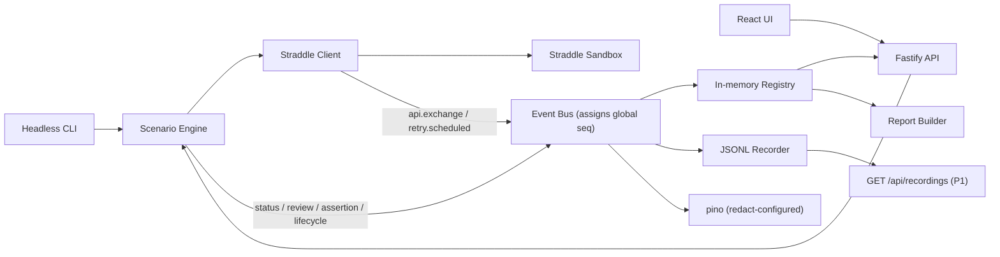

# Technical Design — Straddle Sandbox Explorer (v2)

Source PRD: Straddle Sandbox Explorer v4, July 6, 2026.
Supersedes: Technical Design v1. Changes are marked throughout; the change log is in §17.

## 1. Purpose

Straddle Sandbox Explorer is a local Vite + React and Node.js application that exercises Straddle's sandbox ACH lifecycle scenarios A–E, shows live state transitions, records every event as JSONL, and produces a schema-validated report. The implementation supports two entry points over the same engine:

- Browser demo: single-screen live explorer.
- Headless runner: `npm run scenarios -- --all` or `--scenario c`.

The product is deliberately local-only: no database, no auth, no production Straddle host, and no persistence beyond `./report.json` (repo root) plus `./runs/<run_id>.jsonl`. Both paths are pinned here and gitignored — recordings are never committed; test fixtures are synthetic files under `__fixtures__/`, never captured output.

## 2. Design Principles

- **M0 decides API truth.** No durable app architecture depends on guessed Straddle paths, enums, headers, or SDK behavior.
- **The event stream is the source of truth.** UI, recorder, replay, reports, and logs are projections of one event bus. There is exactly one bus per process; consumers subscribe, they are not passed around as separate optional parameters.
- **Credential redaction happens before capture, server-side only.** API keys,
  auth material, paykey tokens, account/routing numbers, and hard identifiers
  never enter events, reports, recordings, browser payloads, or app logs.
  Non-credential sandbox evidence may be captured so the UI can inspect what
  the sandbox returned. The redactor lives in `server/` — nothing in `web/`
  may ever need it, and its absence from the client bundle is itself an
  invariant.
- **Shared schemas are contracts.** Server, CLI, scripts, and web import the same Zod-backed types from `shared/`. Facts derivable from a contract (e.g. "this scenario expects a reversal") are derived, never stored alongside it.
- **Interface-first, mock-second, sandbox-last.** Every consumer of the Straddle client is built against the `StraddleClient` interface and a scripted mock before the real adapter exists.
- Scenario execution is concurrent in web mode. Serial execution is CLI-only and P1.
- Scenario C must observe `paid` and later `reversed`; terminal `reversed` without prior observed `paid` is a failure. **M0 resolution (§18.1): the live sandbox never surfaces `paid`/`reversed` on `reversed_*` outcomes — this contract is retained for the mock client and replay; live Scenario C asserts the documented deviation evidence instead.**

## 3. Architecture Overview



Runtime shape:

- `shared/`: Zod schemas only — scenario contracts, event types, report schema, seeded bank constants. Zero runtime behavior.
- `server/`: redactor, Straddle client (real + mock), engine, poller, recorder, report evaluator, Fastify HTTP API, CLI.
- `web/`: Vite React single-screen app, event reducer, timeline, scenario list, exchange log.
- `spike/`: M0 throwaway scripts and local captures. Gitignored.
- `runs/`: generated JSONL recordings. Gitignored — decided, not optional.
- `scripts/`: `check-secrets` and any repo tooling.

**Process identity (`epoch`).** The server generates `epoch = crypto.randomUUID()` at boot. Every `/api/events` and `/api/health` response carries it. `seq` is globally monotonic *per process*; a client whose stored epoch differs from the response epoch discards its state and re-hydrates from `GET /api/runs`. Without this, a server restart during development leaves the browser polling a stale cursor forever.

## 4. Repository Layout and Toolchain

```text
straddle-sandbox-explorer/
  package.json              # workspaces; engines: node >=20
  .env.example              # STRADDLE_API_KEY=sk_sandbox_...
  .gitignore                # spike/, runs/, report.json, web/dist, .env
  api-notes.md              # M0 exit artifact
  spike/
    notes/                  # per-probe notes, consolidated into api-notes.md
    captures/               # local; auth headers never written by construction
  scripts/
    check-secrets.ts
  shared/
    src/scenario.ts         # ScenarioId, ScenarioDef, RequiredObservation
    src/events.ts           # RunEvent union, StatusTransition
    src/report.ts           # ReportSchema, IdentityReviewSummary, ApiRefusal
    src/constants.ts        # SEEDED_BANK (routing/account test constants)
  server/
    src/config.ts           # env: STRADDLE_API_KEY, PORT (default 8787),
                            # poll-policy overrides (tests only)
    src/logger.ts           # pino factory with mandatory redact paths
    src/redaction.ts        # moved here from shared/ (see §8)
    src/straddle/client.ts  # real adapter (SDK or fetch per M0)
    src/straddle/mock.ts    # scripted mock client — first-class deliverable
    src/straddle/errors.ts  # StraddleApiError
    src/engine/bus.ts       # event bus: seq assignment, fan-out
    src/engine/scenarios.ts # declarative defs + registry of runnable IDs
    src/engine/poller.ts
    src/engine/registry.ts # in-memory run/event projection; bus subscriber
    src/engine/runner.ts
    src/engine/evaluator.ts
    src/engine/report.ts
    src/engine/recorder.ts
    src/http/server.ts
    src/http/routes.ts
    src/cli.ts
  web/
    src/api.ts
    src/state/eventStore.ts
    src/App.tsx
    src/components/{ScenarioList,Timeline,ExchangeLog,RunSummary,StartupState}.tsx
```

**Toolchain (pinned, minimal):** Node 20 LTS (`engines`), TypeScript strict everywhere, `tsx` for dev execution and spike scripts, `vitest` for unit/integration tests across workspaces, Playwright as a dev-dependency for the Wave 4 browser QA task, Tailwind in `web/`. Runtime dependencies: `zod` (shared), `fastify` + `@fastify/static` (+ its bundled pino) server-side, `@straddlecom/straddle` if M0 selects the SDK, `react`/`react-dom` in web. Nothing else without a stated reason.

**Dev vs start.** `npm run dev`: `tsx watch` server on `:8787` plus Vite on `:5173` with a proxy of `/api` → `8787`. `npm start`: builds `web/dist` if absent, compiles server, serves everything single-origin on `:8787`. `PORT` overridable via env.

## 5. Core Data Contracts

All contracts live in `shared/` and are consumed by server, CLI, scripts, tests, and web.

### Scenario

```ts
// Full planned set, so P2 scenarios are not a breaking schema change.
// The runnable set is gated by the scenario REGISTRY, not the type.
export const ScenarioIdSchema = z.enum(["a","b","c","d","e","f","g","h","i"]);
export type ScenarioId = z.infer<typeof ScenarioIdSchema>;

// Required observations are structured, not strings — the evaluator's input
// must be able to express ordering (C), code requirements (B), and E's
// two-part gate without ad-hoc parsing.
export const RequiredObservationSchema = z.discriminatedUnion("kind", [
  z.object({ kind: z.literal("terminal_status"),
             status: z.string(),
             returnCode: z.string().optional(),      // B: "R01"
             requireReasonDetail: z.boolean().optional() }), // D
  z.object({ kind: z.literal("ordered_statuses"),
             statuses: z.array(z.string()).min(2) }), // C: ["paid","reversed"]
  z.object({ kind: z.literal("customer_review"),
             status: z.string() }),                   // E: "rejected"
  z.object({ kind: z.literal("api_refusal"),
             afterAction: z.enum(["create_paykey","create_charge"]) }), // E; M0 picked create_paykey (422) — create_charge kept for enum stability, unreachable (§18.4)
]);

export const ScenarioDefSchema = z.object({
  id: ScenarioIdSchema,
  label: z.string(),
  purpose: z.string(),
  flow: z.array(z.string()).min(1).optional(), // human-readable scenario steps
  outcomes: z.object({
    customer: z.string().optional(),
    paykey: z.string().optional(),
    charge: z.string().optional(),
  }),
  requiredObservations: z.array(RequiredObservationSchema).min(1),
});

// DERIVED, not stored — one source of truth:
export const expectsReversal = (def: ScenarioDef) =>
  def.requiredObservations.some(o =>
    o.kind === "ordered_statuses" && o.statuses.includes("reversed"));
```

### RunEvent

Every event carries a **globally monotonic per-process `seq`** (assigned by the bus, never by producers), ISO `timestamp`, `run_id`, and `scenario_id`. `run_id` format: `run-<yyyymmddThhmmssZ>-<scenario>-<rand4>` — sortable, unique, embeds the scenario per the handoff's external_id convention.

```ts
export const RunEventSchema = z.discriminatedUnion("type", [
  RunStartedEventSchema,        // scenario def snapshot, run_id
  ApiExchangeEventSchema,       // method, path, status, latency_ms, attempt,
                                // credential-redacted request/response bodies
  CustomerReviewChangedEventSchema, // settled review state + IdentityReviewSummary
  PaymentStatusChangedEventSchema,  // resource id, from, to, return/reason codes,
                                    // credential-redacted detail
  RetryScheduledEventSchema,    // status/error class, attempt, delay_ms
  ScenarioAssertionEventSchema, // one per RequiredObservation: kind, pass, diagnostic
  RunCompletedEventSchema,      // final scenario result, duration_ms, recording_path
]);
```

Consequences of global `seq`:

- Per-run JSONL files contain **gaps** in `seq` (other runs' events interleave). Lines are ordered within a file; no consumer may assume density.
- The web cursor is `max(seq)` seen, valid only for the current `epoch` (§3).

### StatusTransition, IdentityReviewSummary, ApiRefusal

Defined here because acceptance hangs on their contents:

```ts
export const StatusTransitionSchema = z.object({
  from: z.string().nullable(),      // null for the first observation
  to: z.string(),
  at: z.string().datetime(),
  return_code: z.string().optional(),
  reason: z.string().optional(),
});

export const IdentityReviewSummarySchema = z.object({
  verification_status: z.string(),
  risk_score: z.number().optional(),        // field names finalized per api-notes.md
  correlation_score: z.number().optional(),
  reason_codes: z.array(z.string()).default([]),
});

export const ApiRefusalSchema = z.object({
  attempted_action: z.enum(["create_paykey","create_charge"]),
  http_status: z.number(),
  error_body: z.unknown(),          // Straddle's body, verbatim post credential-redaction
});
```

### Report

`ReportSchema` is the final acceptance contract. Both CLI and UI export serialize through `ReportSchema.parse`.

```ts
export const ReportSchema = z.object({
  generated_at: z.string().datetime(),
  suite: z.object({
    status: z.enum(["passed","failed","partial"]),
    duration_ms: z.number(),
    covered_scenarios: z.array(ScenarioIdSchema),
  }),
  scenarios: z.array(z.object({
    id: ScenarioIdSchema,
    name: z.string(),
    status: z.enum(["passed","failed","partial"]),
    resource_ids: z.record(z.string(), z.string()),
    transitions: z.array(StatusTransitionSchema),
    final_status: z.string().optional(),
    return_code: z.string().optional(),
    reason_code: z.string().optional(),
    identity_review: IdentityReviewSummarySchema.optional(),
    refusal: ApiRefusalSchema.optional(),
    recording_path: z.string(),
    duration_ms: z.number(),
    diagnostics: z.array(z.string()),
  })),
});
```

**Suite semantics (replaces the undefined "suite ID"):** there is no suite entity. A report is computed over the **latest run per scenario** present in the registry (or, for the CLI, the runs of that invocation). `suite.status` is `passed` iff all of A–E are covered and passed; `failed` if any covered scenario failed; `partial` if fewer than the five required scenarios are covered. Scenario-level `partial` means the run was interrupted before `run.completed` (its recording lacks the completion line). `v1`'s `running` report status is removed: a report is a snapshot of completed evidence; the UI shows liveness through events, not through the report. This definition works identically for `--scenario c` (suite: partial), a full CLI batch, and ad-hoc re-runs from the dashboard.

## 6. Engine Design

The engine owns all lifecycle behavior. It knows nothing about React, HTTP polling, or terminal formatting.

### Event bus

```ts
type EventBus = {
  emit(e: Omit<RunEvent, "seq">): RunEvent;      // assigns seq, timestamps if absent
  subscribe(fn: (e: RunEvent) => void): () => void;
};
```

One bus per process. Registry, recorder, and logger are **subscribers**, not constructor parameters of the runner — v1's `recorder?: Recorder` next to `eventSink` invited double-writing or forgetting one. The CLI and HTTP server construct the same wiring: `bus → [registry, recorder, pino]`.

### Main interfaces

```ts
type RunOptions = {
  scenarios: ScenarioId[];
  concurrency: "concurrent" | "serial";   // serial reachable from CLI only
  bus: EventBus;
  clock?: Clock;                           // now() + sleep(); fake in tests
};

type StraddleClient = {
  health(): Promise<HealthResult>;
  createCustomer(input: CustomerInput): Promise<CustomerResult>;
  getCustomerReview(customerId: string): Promise<CustomerReviewResult>;
  createPaykey(input: PaykeyInput): Promise<PaykeyResult>;
  createCharge(input: ChargeInput): Promise<ChargeResult>;
  getCharge(chargeId: string): Promise<ChargeResult>;
};
```

The client receives the bus at construction and emits `api.exchange` / `retry.scheduled` itself; the engine never re-wraps HTTP telemetry.

### Error model

```ts
class StraddleApiError extends Error {
  status: number;
  errorBody: unknown;     // redacted before construction
  path: string;
  retryable: boolean;     // 429/5xx true; other 4xx false
  requestId?: string;
}
```

The client retries retryable errors internally (exponential backoff + jitter, `Retry-After` honored when present — M0 never observed one, so the policy must not depend on it — each retry emitting `retry.scheduled`) and throws `StraddleApiError` when exhausted, or immediately for non-retryable 4xx. Scenario E's runner step **catches** `StraddleApiError` from the deliberate post-rejection action and records it as `ApiRefusal` evidence — the one place a 4xx is success. Everywhere else, a thrown `StraddleApiError` fails the run with a diagnostic and a `run.completed` of status `failed`. Hard-timeout expiry (poller, below) does the same: diagnostic `"hard timeout after Nms in status <s>"`, status `failed`, clean `run.completed` — a timeout is a result, not a crash.

### Scenario flow

Scenarios A–D:

1. Emit `run.started`.
2. Create customer with scenario customer outcome.
3. Settle customer review — **synchronous per M0** (the forced status is already terminal in the 201 create response; the generic poller is not needed for customers) — and emit `customer.review_changed` with the `IdentityReviewSummary` (mapping per api-notes.md §6: `verification_status` ← customer `status`, scores ← `identity_details.breakdown`; never key on `identity_details.decision`, which reads `accept` even for rejected customers).
4. Create paykey via the M0-confirmed endpoint (+ any required headers).
5. Create charge with scenario charge outcome, consent metadata, `payment_date`, `external_id = run_id`.
6. Poll the charge until the scenario's settled-predicate (derived from `requiredObservations`) returns true or the hard timeout fires.
7. Evaluator emits one `scenario.assertion` per required observation.
8. Emit `run.completed`.

Scenario E: steps 1–3 with `rejected`; then deliberately attempt the M0-designated action; catch and record the refusal; evaluate both gates; `run.completed`.

### Poller

Generic over resource type; policy is data, predicates are typed:

```ts
type PollPolicy = {
  baseMinMs: number;    // 15_000 default
  baseMaxMs: number;    // 30_000 default (uniform jitter)
  fastMs: number;       // 5_000; M0: the paid→reversed window is unobservable live —
                        // justified instead by the measured ~241s reversal-window analog (§18.1)
  hardTimeoutMs: number; // ~600_000
};

async function poll<T>(args: {
  fetch: () => Promise<T>;
  isSettled: (value: T, observations: T[]) => boolean;
  switchToFast?: (value: T) => boolean;   // typed against T, not unknown
  policy: PollPolicy;
  clock: Clock;
  onObservation: (value: T) => Promise<void>;
}): Promise<T>;
```

Rules:

- `switchToFast` is a **latch**: once any observation matches, the interval stays at `fastMs` until settled. For reversal scenarios it matches the first `pending` observation (M0: `pending` is the status preceding any terminal, and the reversal-style terminal lands a deterministic ~241 s after the last `pending` history event).
- If Scenario C's settled-predicate fires on `reversed` without `paid` in `observations`, the evaluator fails the run with the loud diagnostic required by the PRD.
- **Process-wide rate floor:** all pollers share a scheduler enforcing a minimum gap (~250 ms) between any two Straddle requests, and every poller yields to `Retry-After`. Fast mode across five concurrent scenarios must not become a self-inflicted 429 storm; the floor bounds worst-case request rate regardless of policy values.

## 7. Straddle Client Boundary

`server/src/straddle/client.ts` is the only module that calls Straddle. Responsibilities: load the key server-side only; hard-code the sandbox base URL; select SDK or `fetch` per M0; attach auth and M0-confirmed idempotency/request headers; keep SDK/fetch verbose logging off; retry per the §6 error model; credential-redact **before** constructing results, errors, or events; emit one `api.exchange` per HTTP exchange (attempt-numbered).

No other module imports SDK types. SDK outputs are wrapped in local DTOs so a later `fetch` fallback cannot leak through the codebase.

**`server/src/straddle/mock.ts` is a first-class deliverable, not a test detail.** It implements `StraddleClient` with scripted per-scenario transition schedules on an injectable clock (e.g. C: pending@t0, paid@t1, reversed@t2). It unblocks runner/evaluator/CLI/HTTP/UI development before and independent of the real adapter, powers the §12 integration tests, and generates synthetic recordings for replay development.

## 8. Redaction and Logging

The redactor lives in `server/src/redaction.ts` — moved out of `shared/` deliberately. Nothing in `web/` may ever need it; if the browser needed a redactor, secrets would already have crossed the wire. Scripts and tests import it from the server workspace. A trivial guard test asserts the redactor module is not reachable from the web bundle.

Masking (Layer 1, structural, at capture time): authorization and key-like headers; the key in strings, URLs, query params, JSON bodies, and error echoes; paykey tokens; TAN; SSN/EIN/DOB; IP address; account/routing **fields by name** (variants per `api-notes.md`), including nested objects and arrays — field-name matching catches sandbox-*generated* values without knowing them in advance. Non-credential sandbox evidence is deliberately preserved for inspection: customer names, email/phone, addresses, review/status details, metadata, and response diagnostics stay visible unless they contain one of the credential/canary patterns above.

**Canary mechanism (Layer 2) — concrete, no sensitive file:** `scripts/check-secrets.ts` builds its canary list at scan time from (a) `STRADDLE_API_KEY` read from the environment and (b) the static `SEEDED_BANK` constants imported from `shared/src/constants.ts` — the only account/routing values the engine ever sends. Nothing sensitive is ever persisted for the scanner's benefit. The script greps server log output, `report.json`, `runs/*.jsonl`, and `web/dist`, verifies `spike/` and `runs/` are untracked by git, and exits non-zero on any hit.

Logging (Layer 3): Fastify serializers restricted to method, URL, status, latency, run/scenario IDs; raw HTTP bodies never logged anywhere; pino `redact` covers authorization headers and account/routing paths as defense in depth; no SDK/fetch debug mode in normal operation. The canary test (§12) runs at the most verbose configured level specifically to exercise this path.

## 9. HTTP API

Fastify serves the JSON API and static `web/dist` in `npm start` mode.

| Endpoint | Method | Body / Query | Response |
| --- | --- | --- | --- |
| `/api/health` | GET | none | `{ epoch, key: "ok"\|"missing"\|"invalid", error_body? }` — M0: the sandbox 401 has an empty body, so `error_body` is normally absent for invalid keys (§18.5) |
| `/api/runs` | POST | `{ scenarios: ["a","b"] }` | created run IDs |
| `/api/runs` | GET | none | registry snapshot (all runs, latest-per-scenario marked) |
| `/api/events` | GET | `?since=<seq>` | `{ epoch, events: RunEvent[] }` with `seq > since` |
| `/api/report` | GET | none | `ReportSchema` report per §5 suite semantics |
| `/api/recordings` | GET | none | list of `{ run_id, path, complete }` (P1, for replay) |
| `/api/recordings/:run_id` | GET | none | the JSONL file (P1; already credential-redacted) |

Semantics: `POST /api/runs` is always accepted, including while other runs are live — each run is independent, and re-running a scenario simply becomes the new "latest run" for report and dashboard purposes. No `mode` parameter exists; web execution is concurrent by design. P0 event delivery is client polling every ~2 s; P1 adds SSE on the same `RunEventSchema` without contract change.

## 10. Frontend Design

Single route; a projection of the event log.

- `api.ts`: typed wrappers; every response's `epoch` is checked against the stored one — mismatch clears state and re-hydrates from `GET /api/runs` (§3).
- `eventStore.ts`: reducer over `RunEvent[]`, keyed by `run_id`, ordered by `seq` **without assuming density**; derives per-scenario latest run, selected scenario, timeline nodes, exchange list.
- `App.tsx`: shell + startup states (health loading → missing-key instructions → invalid-key error with credential-redacted Straddle body → ready).

P0 layout: header (sandbox badge, Run All); left pane scenario rows A–E (purpose, outcome, status chip, Run); center timeline (every observed transition, elapsed deltas, amber provisional `paid` in reversal scenarios, both `paid` and `reversed` as separate nodes, return/reason codes on terminal nodes); right pane chronological credential-redacted exchange list (method, path, status, latency, formatted JSON — no search, filters, cURL, or tree at P0); compact summary strip with report download (blob of `GET /api/report`).

P1: identity panel renders the already-captured review summary **and the paykey summary** (masked account, status, institution) per PRD FR-4 — the paykey half was dropped in design v1.

## 11. Recording and Replay

P0 recorder (a bus subscriber): one file per run at `runs/<run_id>.jsonl`; append + flush per event; every line independently parseable; `run.completed` marks clean completion; partial files are valid prefixes; the report carries each recording path; no rotation or cleanup at P0.

P1 replay: the browser fetches recordings via the §9 endpoints (no file-picker plumbing); validates each line against `RunEventSchema`; feeds the same reducer used live — which works precisely because the reducer already tolerates non-dense `seq` (§5); plays at a fixed 10×; partial recordings play to the last line and show a partial marker. Synthetic recordings generated with the mock client serve as replay fixtures before any live capture exists.

## 12. Test Strategy

### Unit

- Shared schemas accept valid and reject malformed fixtures, including every `RequiredObservation` kind.
- Redactor: known-value fixture across header variants, nested bodies, arrays, query strings, error echoes, and the recorded-event serialization path — zero survivals. Plus the web-bundle-unreachability guard.
- Poller (fake clock): baseline jitter bounds; fast-mode latch; hard timeout emits the failure path; rate-floor scheduler enforces the min gap.
- Evaluator: each observation kind; C fails on `reversed` without prior `paid`; E fails unless both rejected review and refusal are present; timeout produces `failed` + diagnostic, never a crash.
- Recorder: valid JSONL prefixes; completion line; gap-tolerant seq.

### Integration (mock client, fake clock)

- Engine runs A–E against scripted schedules; report parses and matches expected pass/fail.
- **Round-trip equality mechanics:** one engine run, serialized through the CLI writer path and through the HTTP `/api/report` handler path, both `ReportSchema.parse`d, deep-equal — this is the falsifiable form of "schema-identical," runnable without the sandbox and without needing two live runs to coincide.
- HTTP: `POST /api/runs` → `/api/events?since=0` advances; epoch present; re-run of a scenario updates latest-per-scenario in `/api/report`.
- Replay: synthetic recording (mock-generated) plays through the reducer; partial recording marked.

### Live sandbox (after M0, before demos)

`npm run scenarios -- --all`; `npm run check:secrets`; the canary run (dummy key, most verbose logging, zero survivals); Scenario C live captures the documented deviation evidence (`failed` + reversal R-code + ~241 s reversal-window delay per §18.1) while the `paid`→`reversed` ordered observation is exercised via mock and replay; Scenario E captures rejection + structured refusal; clean-clone smoke `npm install && npm start`.

## 13. Wave Plan and Parallel Subtasks

### Wave 0 — M0 API truth spike (phased; parallelism is limited by real dependencies)

Design v1 presented six parallel probes; that parallelism was false — every probe depends on the transport/auth decision, the C-timing probe depends on the paykey/charge probe, and the E probe depends on the customer probe. The honest structure is phases. The spike is small enough that **one agent executing the phases serially is an acceptable and possibly optimal plan**; if parallel agents are used, they follow the phase graph and write to `spike/notes/<topic>.md`, with a single consolidation step — never six writers appending to one `api-notes.md`.

| Phase | Subtask | Output |
| --- | --- | --- |
| 0a (blocks all) | Transport + auth probe | SDK vs fetch decision, base URL confirmed, auth ping behavior |
| 0b (parallel ×2) | Customer/identity probe · Paykey/charge probe | outcomes, review endpoint + sync/async timing + payload · paykey path, headers, charge fields, polling endpoint, observed enums |
| 0c (parallel ×2) | Scenario C timing probe · Rejected-identity refusal probe | measured `paid → reversed` window + pre-paid status · refused action + structured error semantics |
| 0d | Consolidation + field inventory | `api-notes.md` (authoritative paths, headers, enums, timings, account/routing field variants, idempotency header, deviations) |

Exit: `api-notes.md` committed; `spike/captures/` populated locally; auth headers never written by construction; `spike/` untracked.

### Wave 1 — Repo, contracts, and safety foundation

| Subtask | Files | Dependencies |
| --- | --- | --- |
| Workspace scaffolding + toolchain | root `package.json`, TS configs, scripts, `.gitignore` | M0 |
| Shared schemas (incl. `RequiredObservation`, constants) | `shared/src/*` | M0 names |
| Redactor + tests | `server/src/redaction.ts` | M0 field inventory |
| Logger + config | `server/src/{logger,config}.ts` | workspace |
| Event bus + recorder | `server/src/engine/{bus,recorder}.ts` | shared events |
| **Mock Straddle client** | `server/src/straddle/mock.ts` | shared contracts |

Exit: install/typecheck/unit tests green; schemas exist; redaction fixture tests pass; recorder writes valid prefixes; **mock client can script a full Scenario C schedule on a fake clock** — this is what makes Wave 2 genuinely parallel.

### Wave 2 — Engine and headless runner (M1)

All engine consumers develop against the interface + mock; the real client lands independently; **sandbox access during this wave is serialized through the API-Client owner** to avoid rate-limit contention between agents.

| Subtask | Files | Dependencies |
| --- | --- | --- |
| Real Straddle client adapter + error model | `server/src/straddle/{client,errors}.ts` | Wave 1, M0 |
| Scenario definitions + registry | `server/src/engine/scenarios.ts` | shared schemas |
| Generic poller + rate-floor scheduler | `server/src/engine/poller.ts` | M0 timings |
| Runner orchestration | `server/src/engine/runner.ts` | bus, scenarios, poller, **mock** |
| Evaluator + report writer | `server/src/engine/{evaluator,report}.ts` | shared report schema |
| CLI | `server/src/cli.ts` | runner, report writer |
| Secret checker | `scripts/check-secrets.ts`, package script | redactor, constants |

Exit: design-v1's list, plus: hard-timeout path tested; round-trip equality test green on the CLI side; `check:secrets` green including the untracked checks.

### Wave 3 — HTTP layer (M2)

Registry + routes + static/start mode + integration tests, as design v1 — with the additions: epoch in `/api/events` and `/api/health`; latest-per-scenario report semantics verified; re-run-while-live accepted.

### Wave 4 — React single-screen UI (M3)

As design v1 (state, shell/startup, list, timeline, exchange log, summary, Playwright QA), with these exit corrections: the Run All target is the **PRD's ~15 minutes** (the M0-measured timings either confirm the budget or force a plan change — "subject to sandbox timing" is not an exit criterion); epoch-reset behavior demonstrated by restarting the server mid-session; the round-trip equality test now covers the UI export path.

### Wave 5 — P1 resilience before polish (M4)

Order unchanged from design v1 and deliberate: 1 replay viewer (via `/api/recordings`, partial marker, mock-generated fixture first) · 2 SSE · 3 identity **+ paykey** panel · 4 inspector filter/tree · 5 event console drawer · 6 CLI `--serial` · 7 header key-status pill.

### Wave 6 — Dry runs, then P2 options (M5)

Required: live dry-run with timing notes; replay-only dry-run; README (setup, commands, artifact locations, **Deviations from spec**); final `check:secrets`, canary run, clean-clone smoke, report validation. Optional P2 afterward: cURL copy, scenario H hold release, F/G/I, webhooks, replay scrubber, toasts, payouts.

## 14. Parallel Agent Coordination Rules

- File ownership by wave; no edits to another agent's files without explicit handoff.
- **Contract freeze:** `shared/` changes after Wave 1 exit go through the Contracts owner and require synchronized updates to engine tests, HTTP tests, and UI reducer fixtures in the same change.
- **Interface-first:** consumers of `StraddleClient` build against the interface and mock; only the API-Client owner talks to the live sandbox during Wave 2.
- M0 agents (if parallel) write `spike/notes/<topic>.md` per the phase graph; one consolidation task owns `api-notes.md`.
- Any live-API divergence is documented in `api-notes.md` and mirrored in README "Deviations from spec."
- Security tasks can block wave exits if redaction, canary, or `check:secrets` fails.

## 15. Key Risks and Mitigations

| Risk | Mitigation |
| --- | --- |
| M0 contradicts assumed paths/enums | api-notes.md authoritative; durable code starts after M0 |
| SDK instability | SDK isolated behind `client.ts` + DTOs; `fetch` fallback |
| Scenario C misses `paid` | Adaptive fast-poll latch + fail-loud evaluator |
| Customer review is slow async | Generic poller covers customers; M0 settle time feeds the 15-min budget check |
| Rate limits under concurrency + fast mode | Process-wide rate floor, `Retry-After` honored, retry events observable, CLI serial fallback |
| Secrets leak through logs | Capture-time redaction, pino redact, canary scan at max verbosity, bundle-unreachability guard |
| Server restart strands the web cursor | Epoch in event/health envelopes; client resets on mismatch |
| Contract churn destabilizes parallel work | Wave 1 contract freeze + synchronized-fixture rule |
| Live sandbox unavailable during meeting | Replay viewer first in Wave 5; synthetic mock recordings exist even before live captures |

## 16. Final Acceptance Checklist

- `api-notes.md` exists with sanitized M0 evidence and deviations; README carries "Deviations from spec."
- Clean clone: `npm install && npm start` serves the browser app locally.
- `npm run scenarios -- --all` writes `ReportSchema`-valid `./report.json` and JSONL recordings.
- Scenario A: terminal `paid`. B: terminal `failed` + expected return code. C: **mock/replay** demonstrates observed `paid`, then `reversed`, timestamps + code — and the diagnostic fires if `paid` was never observed; **live** C captures the §18.1 deviation evidence (`failed` + reversal R-code + ~241 s delay). D: **mock/replay** demonstrates `cancelled` + reason detail; **live** D captures the §18.8 deviation evidence (watchtower `failed` + structured reason detail). E: rejected review **and** structured refusal captured.
- Browser Run All completes A–E concurrently, live, within the ~15-minute budget.
- Missing-key and invalid-key states are clean and stack-trace-free in both entry points.
- **Round-trip equality test green:** CLI-path and HTTP-path serializations of the same run parse and deep-equal.
- `npm run check:secrets` green, including `spike/` and `runs/` untracked checks.
- **Canary run green at maximum configured log verbosity.**
- Retries, when they occur, visible in structured logs (M1) and the exchange list (M3+).
- Replay demos at least one recorded Scenario C offline, including a partial-recording case.

## 17. Change Log (v1 → v2)

Contracts: `RequiredObservation` discriminated union replaces stringly observations; `expectsReversal` derived, not stored; `ScenarioId` covers a–i with a runtime registry gating runnable scenarios; `StatusTransition`/`IdentityReviewSummary`/`ApiRefusal` defined; report `running` status removed and suite semantics defined as latest-run-per-scenario with `partial` meaning incomplete coverage (suite) or interrupted run (scenario). Event model: single event bus assigns globally monotonic per-process `seq`; recorder/registry/logger are subscribers; per-run JSONL has seq gaps by design; `epoch` added to survive server restarts. Engine: `StraddleApiError` error model with Scenario E's refusal-as-evidence carved out; hard timeout defined as a failed result, not a crash; poller `switchToFast` typed against `T` and specified as a latch; process-wide rate floor added. Security: redactor moved from `shared/` to `server/` with a bundle-unreachability guard; canary mechanism made concrete (env key + static seeded constants; nothing sensitive persisted); `runs/` gitignore decided. HTTP: suite ID removed; recordings endpoints added for replay; re-run-while-live semantics defined. Layout/toolchain: `scripts/` added; `report.json` path pinned; dev/start orchestration and ports specified; Node/vitest/tsx/Playwright pinned. Waves: Wave 0 restructured into a dependency-honest phase graph with single-writer consolidation; mock Straddle client promoted to a named Wave 1 deliverable enabling genuine Wave 2 parallelism; sandbox access serialized during Wave 2; Wave 4 exit restored to the PRD's hard 15-minute target; identity panel reunited with the paykey summary. Checklist: canary run, round-trip equality, and retries-in-logs restored from the PRD.

## 18. M0 Resolutions (v2.1, Wave 0 gate — evidence in api-notes.md)

Live-sandbox facts recorded at the Wave 0 gate on 2026-07-07. Where they contradict earlier sections, this section and `api-notes.md` win. Full deviation list: api-notes.md §12.

1. **Scenario C.** The sandbox never surfaces `paid` or `reversed` on `reversed_*` charge outcomes (observed 3×, both seeded accounts, both `balance_check` settings — contradicting Straddle's own sandbox guide): the lifecycle is `created → scheduled → pending → failed`, with the reversal's R-code landing a **deterministic ~241 s after the last `pending` history event** (~5 m 50 s total; plain `failed_*`/`paid` outcomes take ~117 s). Resolution: the `ordered_statuses ["paid","reversed"]` contract, evaluator rule, and provisional-paid UI are **unchanged** and exercised via the mock client and replay; the **live** Scenario C run instead asserts `failed` + expected reversal R-code + the ≥~4-minute reversal-window delay as its documented deviation evidence. Re-check the live behavior with one charge before Wave 2 exit (webhook-only reversal signaling is not ruled out).
2. **Sandbox state is mutable and can be poisoned.** An R05 dispute return permanently blocks both the paykey and the underlying seeded bank account for new paykey creation. Engine rules: fresh customer+paykey per run (mandatory, not stylistic); never use `*_customer_dispute` outcomes in repeatable scenarios; `SEEDED_BANK` carries both documented account numbers with `987654321` preferred (`123456789` is R05-blocked on this key). R01 returns do not poison.
3. **Customer review is synchronous** (`config.sandbox_outcome`, inline processing): the forced status is terminal in the 201 create response; the generic poller applies to charges only. `IdentityReviewSummary` maps from the review payload per api-notes.md §6; the rejected gate keys on customer `status`, never `identity_details.decision` (which reads `accept` even when rejected).
4. **Scenario E refusal = `create_paykey`**: POST `/v1/bridge/bank_account` for a rejected customer returns a deterministic 422 whose body is not self-describing — the evaluator asserts `status === 422` ∧ `error.items` absent ∧ `error.detail` matches `/customer is rejected/i`. `create_charge` is structurally unreachable as a refusal point and stays in the enum for stability only.
5. **Auth/errors.** The invalid-key 401 has an **empty body** (nothing to render verbatim; UI shows the status line instead). Error envelopes live under a top-level `error` key (`{status, type, title, detail?, items?}`), not `data`. Validation failures arrive in two shapes (400 `/bad_request` PascalCase refs; 422 `/validation_error` lowercase refs). No `Retry-After`/`X-RateLimit-*` headers were observed.
6. **Charge creation requires `config.balance_check`**; scenario definitions pin `"disabled"` (`"required"` watchtower-fails every charge on balance-less bank_account paykeys). Return codes live at `status_details.code` (absent when inapplicable); bank-decline evidence keys on `status_details.source === "bank_decline"`.
7. **Transport.** SDK `@straddlecom/straddle@0.3.0` pinned exact. Wave 2's runtime adapter currently uses direct `fetch` behind `server/src/straddle/client.ts` rather than invoking SDK resource methods, while preserving the same boundary, explicit `baseURL https://sandbox.straddle.io`, local retry/backoff ownership, `api.exchange` per HTTP attempt, `retry.scheduled` per backoff, and explicit `Idempotency-Key` header. The SDK remains isolated as a future swap target; no consumer imports SDK types. Timestamps vary in precision across endpoints — shared schemas use lenient datetime validation, not bare `z.string().datetime()`.
8. **Scenario D (added at the Wave 4 live gate, 2026-07-07).** No observed sandbox path yields a `cancelled` charge status: `cancelled_for_fraud_risk` terminates as **`failed`** in ~7 s with structured watchtower detail (`status_details {reason: "payment_blocked", source: "watchtower", message: "Cancelled for sandbox simulation of Watchtower fraud detection."}`, no R-code), and `cancelled_for_balance_check` (probed with `balance_check: "enabled"`) ran the full bank lifecycle and was still `pending` >8 minutes after the last history event — terminal UNVERIFIED. Resolution mirrors §18.1: the `cancelled` + reason-detail contract stays for mock/replay; the **live** Scenario D def asserts terminal `failed` + `requireReasonDetail` (satisfied by the watchtower reason detail). Appended post-M0 at the Wave 4 gate, together with item 9.
9. **Idempotency-Key value cap (Wave 4 live gate).** Values over ~40 chars are rejected with 400 `/bad_request` ("The Idempotency-Key header value is not valid."): 43-char run-id-derived keys failed while 35–37-char keys passed. The engine sends UUIDs (36 chars). Exact cap and format rule UNVERIFIED.
10. **Budget.** Concurrent Run All worst case ≈ 6 min (C dominates at ~5 m 50 s; ~130 requests total) — inside the ~15-minute budget with >2× headroom. Serial execution would sum to ~16 min: concurrency is load-bearing.
